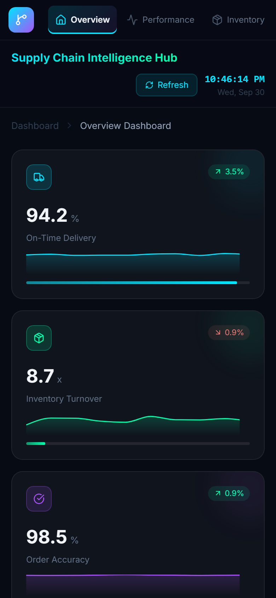

# 🚀 Supply Chain Intelligence Hub

**Real-time analytics dashboard for supply chain optimization with AI-powered insights**

**▶ Live demo: https://junelus.github.io/Real-Time-Supply-Chain-Analytics-Dashboard/**


## 🎯 Skills Demonstrated

This project showcases key capabilities for **Client Success AI/Data Engineer** roles:

- ✅ **Client-Ready Dashboards** - Executive-level KPI tracking and business intelligence
- ✅ **Real-time Data Processing** – Live updates every 3 seconds with data quality monitoring
- ✅ **AI/ML Integration** – Demand forecasting, anomaly detection, route optimization
- ✅ **Supply Chain Analytics** – Warehouse utilization, inventory turnover, delivery performance
- ✅ **Data Visualization** – Interactive charts and responsive design for stakeholder reporting

## 🔧 Technology Stack

- **Frontend**: React 19, Vite 7, Tailwind CSS 4 (via `@tailwindcss/vite`)
- **Data Visualization**: Recharts library for interactive charts
- **Real-time Processing**: State management with live data simulation
- **AI Features**: ML-driven insights with confidence scoring
- **Icons**: Lucide React for professional UI elements
- **Hosting**: GitHub Pages, deployed automatically from `main`

> **Note on data:** every metric and chart in the dashboard is generated client-side by a simulation layer
> (`src/data/simulation.js`). There is no backend or external API. The Demand Forecasting, Anomaly Detection and
> Inventory Prediction insights are genuine computations over that simulated data (`src/data/analytics.js`); the
> other insight cards are illustrative copy and are labelled as such. The project demonstrates dashboard architecture, real-time state
> handling, analytics, and visualization design rather than a connection to a live supply chain system.

## 📊 Key Features

### **Real-time KPI Monitoring**
- Six critical supply chain metrics with trend analysis
- On-Time Delivery, Inventory Turnover, Order Accuracy
- Cost per Shipment, Warehouse Utilization, Customer Rating

### **AI-Powered Insights**
- **Demand forecasting (live, computed)** – the hourly order-volume series is deseasonalised with a known intraday profile (quiet overnight, early-afternoon peak), an ordinary-least-squares line is fitted to the underlying level to measure drift per hour, and the level is projected six hours ahead and re-shaped by the profile. The card reports the trend, the fit quality (R²), the next six hours' volume against the last six, and the forecast peak hour, and recommends adding capacity, easing off, or holding staffing. The Performance view charts the actual hours and the forecast hours side by side.
- **Anomaly detection (live, computed)** – every refresh, the 24-hour on-time delivery series is scored with z-scores against its own mean and standard deviation. Hours beyond 2σ are flagged, the most extreme hour is described with its magnitude, an anomaly score is derived from the normal tail probability, and the card lists the hours to investigate. The simulated feed injects occasional disruptions so there is something real to find.
- **Inventory prediction (live, computed)** – each category's daily burn rate is derived from its optimal stock and annual turnover (optimal × turnover ÷ 365). The reorder point is burn rate × (14-day lead time + 7 days safety stock). Categories at or below it are flagged with days of cover and the order quantity needed to return to optimal; the headline figure is the share of categories still above their reorder point. The simulation consumes about a day of stock per refresh and restocks a category when it runs low, so the card cycles through healthy and reorder states over a session.
- All three live computations live in `src/data/analytics.js` with reference-value and scenario tests. The route optimization, customer behaviour and cost cards are **illustrative samples** and are tagged `SAMPLE` in the UI; the live cards are tagged `LIVE`.

### **Executive Reporting**
- Interactive charts (Area, Bar, Pie) for data visualization
- Real-time alerts with priority classification
- Performance trends over 24-hour periods
- Inventory analysis by product category

## 🚀 Quick Start

**Prerequisites**: Node.js 22.22+ (see `.nvmrc`) and npm. Vite 7 needs 22.12+, and the jsdom test environment needs 22.22+; Node 20 reached end of life in April 2026 and is not supported.

1. **Clone the repository**:
   ```bash
   git clone https://github.com/JUnelus/Real-Time-Supply-Chain-Analytics-Dashboard.git
   cd Real-Time-Supply-Chain-Analytics-Dashboard
   ```

2. **Install dependencies**:
   ```bash
   npm install
   ```

3. **Start development server**:
   ```bash
   npm run dev
   ```

4. **Open browser**: Navigate to `http://localhost:5173`

## 🎨 Dashboard Features

- **Live Clock**: Real-time timestamp updates
- **Data Refresh**: Automatic updates every 3 seconds
- **Processing Indicator**: Visual feedback during data updates
- **Six Views**: Overview, Performance, Inventory, Shipments, AI Insights, Alerts (lazy-loaded per tab)
- **Professional Styling**: Dark theme with gradient accents

## 📸 Dashboard Screenshots

### Overview


### Performance


### Inventory


### Shipments


### AI Insights


### Alerts


### Phone layout (390px)
On narrow screens the sidebar becomes a horizontal nav bar and every grid stacks to a single column.



All screenshots are generated from the production build by `npm run screenshots:update`.

## 🤖 GitHub Actions Automation

### Daily Dashboard CI — `.github/workflows/daily-dashboard-ci.yml`
- Runs on every push, daily at `09:00 UTC`, and on demand via `workflow_dispatch`
- Steps: `npm ci`, `npm audit --omit=dev --audit-level=moderate` (production dependencies only), `npm run lint`, `npm test`, `npm run build`, then `npm run test:e2e` against the built bundle
- Dev-only tooling (ESLint, Vite, Playwright) is excluded from the audit gate so advisories against build helpers do not fail the scheduled run; Dependabot still opens PRs for them
- On an end-to-end failure the Playwright HTML report is uploaded as a workflow artifact

### Deploy to GitHub Pages — `.github/workflows/deploy-pages.yml`
- Runs on every push to `main` and on demand
- Builds the production bundle and publishes `dist/` to GitHub Pages
- Live at https://junelus.github.io/Real-Time-Supply-Chain-Analytics-Dashboard/

### CodeQL — `.github/workflows/codeql.yml`
- Runs on pushes and pull requests to `main`, weekly on Mondays, and on demand
- Analyzes the JavaScript/React source and the GitHub Actions workflows with the `security-and-quality` query suite
- Findings appear under **Security → Code scanning** and as pull request annotations
- Replaces an earlier Qodana workflow that ran the JVM Community linter, which does not inspect JavaScript; the JavaScript linter needs an Ultimate licence

### Dependabot — `.github/dependabot.yml`
- Weekly npm updates, monthly GitHub Actions updates
- Minor and patch bumps are grouped into at most two weekly PRs: one for production dependencies (what ships in the dashboard) and one for dev tooling (build, lint, test). Major bumps still arrive as individual PRs so they get deliberate review
- `playwright` and `@playwright/test` form their own group at any version, so the test runner and browser driver are always bumped together
- All GitHub Actions bumps land in a single monthly PR

## 💼 Business Value

This dashboard demonstrates the ability to:

- Transform complex data engineering into business insights
- Create client-ready visualizations for executive reporting
- Implement AI-driven recommendations with confidence scoring
- Monitor supply chain performance with actionable alerts
- Bridge technical capabilities with measurable business outcomes

## 🎯 Perfect For

- **Data Engineer** portfolio projects
- **Client Success** role demonstrations
- **AI/ML Engineer** skill showcase
- **Business Intelligence** capability proof
- **Supply Chain Analytics** expertise display

## 🔗 Repository Structure

```
Real-Time-Supply-Chain-Analytics-Dashboard/
├── .github/
│   ├── dependabot.yml                  # Weekly npm / monthly Actions updates
│   └── workflows/
│       ├── daily-dashboard-ci.yml      # Audit, lint, build (push + daily schedule)
│       ├── deploy-pages.yml            # Build and publish to GitHub Pages
│       └── codeql.yml                  # CodeQL static analysis (JavaScript + workflows)
├── docs/
│   └── screenshots/                    # README screenshots, one per dashboard tab
├── e2e/
│   └── smoke.spec.js                   # Playwright smoke test against the production build
├── public/                             # Static assets copied as-is into the build
├── scripts/
│   └── update-readme-screenshots.mjs   # Playwright script that regenerates screenshots
├── src/
│   ├── App.jsx                         # Shell: sidebar, top bar, refresh timer, tab routing
│   ├── App.test.jsx                    # Integration tests: navigation, alert count, dismissal
│   ├── main.jsx                        # React entry point
│   ├── index.css                       # Global styles and Tailwind import
│   ├── data/
│   │   ├── simulation.js               # Pure data generators behind every metric and alert
│   │   └── simulation.test.js          # Bounds, window rollover, alert generation
│   ├── test/
│   │   └── setup.js                    # Vitest setup: jest-dom matchers, ResizeObserver stub
│   └── views/
│       ├── OverviewView.jsx            # KPI cards, performance trend, shipment status, regions
│       ├── PerformanceView.jsx         # 24-hour performance analytics
│       ├── InventoryView.jsx           # Inventory by category
│       ├── ShipmentsView.jsx           # Shipment status and regional breakdown
│       ├── AIView.jsx                  # AI insight cards and model metrics
│       ├── AlertsView.jsx              # Priority-classified alerts with dismissal
│       ├── AlertsView.test.jsx         # Severity tiles, empty state, dismissal
│       ├── viewShared.jsx              # Shared cards, tooltip, section headers
│       └── viewShared.test.jsx         # KPICard, AlertItem, CustomTooltip, RegionRow
├── index.html                          # HTML template (Vite entry)
├── vite.config.js                      # Vite config: Pages base path for builds, Vitest settings
├── playwright.config.js                # Playwright config: builds and serves dist/ for e2e
├── eslint.config.js                    # ESLint flat config (React hooks + refresh rules)
├── package.json                        # Dependencies and scripts
├── LICENSE                             # MIT
└── README.md                           # Project documentation
```

## 📈 Data Features

- **Real-time Simulation**: Live data updates every 3 seconds
- **Multiple Data Types**: Performance metrics, inventory levels, shipment status
- **AI Insights**: Machine learning predictions with confidence scores
- **Alert System**: Priority-based notifications for supply chain events
- **Historical Trends**: 24-hour performance analysis

## 🛠️ Development

**Available Scripts**:
- `npm run dev` - Start development server
- `npm run build` - Build for production (output in `dist/`, base path set for GitHub Pages)
- `npm run preview` - Serve the production build locally at `http://127.0.0.1:4173/Real-Time-Supply-Chain-Analytics-Dashboard/`
- `npm run lint` - Run ESLint
- `npm test` - Run the Vitest unit and component suite once
- `npm run test:watch` - Run Vitest in watch mode
- `npm run test:e2e` - Build, serve, and run the Playwright smoke test against the production bundle
- `npm run screenshots:update` - Rebuild and capture fresh screenshots for each dashboard tab

### Testing

Two layers, both run in CI on every push and on the daily schedule:

- **Unit and component tests** (Vitest + React Testing Library, jsdom) cover the simulation layer in `src/data/simulation.js` (KPI drift and clamping, the 24-hour window rollover, alert generation bounds), the shared view components (KPI card formatting and trend colouring, alert dismissal, chart tooltip), the alerts view, and the app shell (sidebar navigation, lazy view loading, live alert count).
- **End-to-end smoke test** (Playwright, Chromium) builds the real production bundle, serves it under the GitHub Pages base path, and checks that every view opens, that no page or console errors occur, that dismissing an alert updates the sidebar badge, and that KPI trend badges stay stable between data refreshes.

```bash
npm test                              # unit + component
npx playwright install chromium       # first time only
npm run test:e2e                      # end-to-end
```

### Refresh README Screenshots

To regenerate `Overview`, `Performance`, `Inventory`, `Shipments`, `AI Insights`, and `Alerts` screenshots:

```bash
npm install
npx playwright install chromium
npm run screenshots:update
```

## 🎨 UI/UX Features

- **Dark Theme**: Professional gradient background
- **Responsive Layout**: three breakpoints - full 220px sidebar with two-column grids on desktop, a 72px icon rail with single-column grids on tablets (≤ 1024px), and a horizontal scrollable nav bar above the content on phones (≤ 640px); the page never scrolls horizontally, which the end-to-end suite checks at 390px, 820px and 1440px
- **Interactive Charts**: Hover effects and tooltips
- **Loading States**: Visual feedback during processing
- **Color Coding**: Intuitive status indicators (green/red/yellow)

## 📄 License

Released under the [MIT License](LICENSE). You are free to use, copy, modify and distribute this code, including commercially, as long as the copyright and licence notice are kept.

---

**Built to demonstrate Client Success AI/Data Engineering skills** • Ready for production deployment

*This project showcases the exact technical and client-facing skills needed for modern data engineering roles in supply chain and logistics.*
